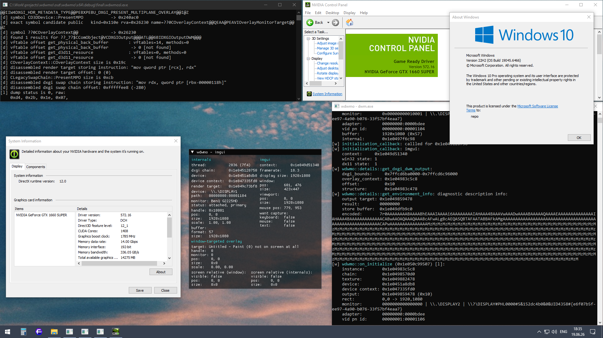
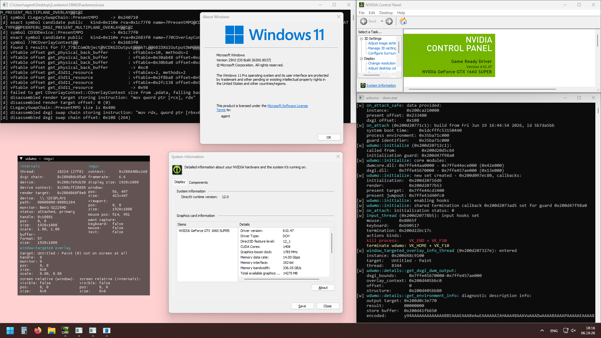
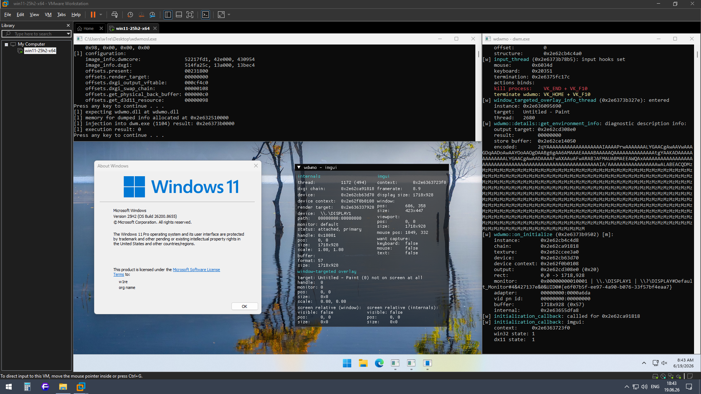
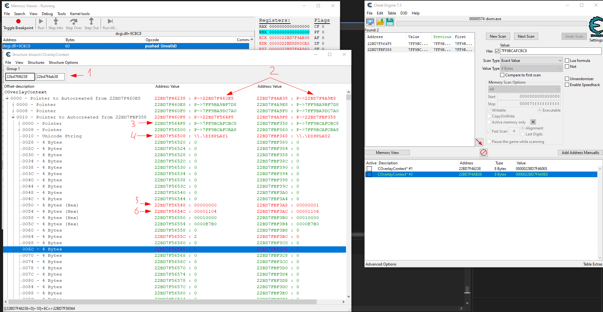
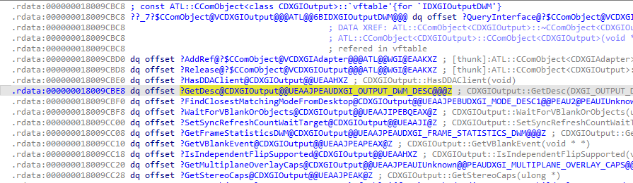
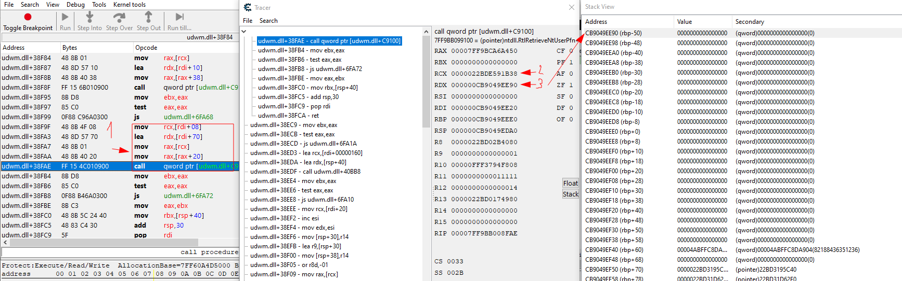
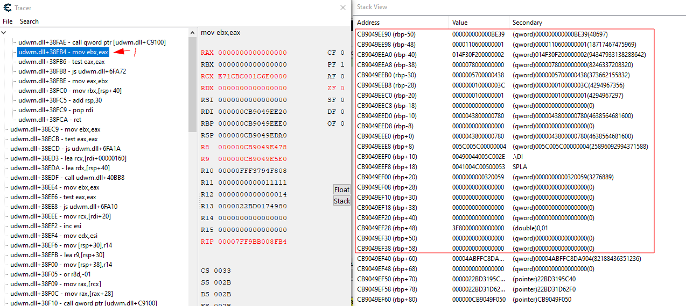
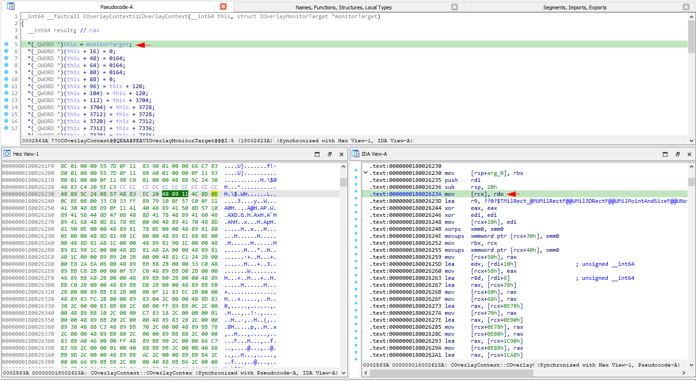
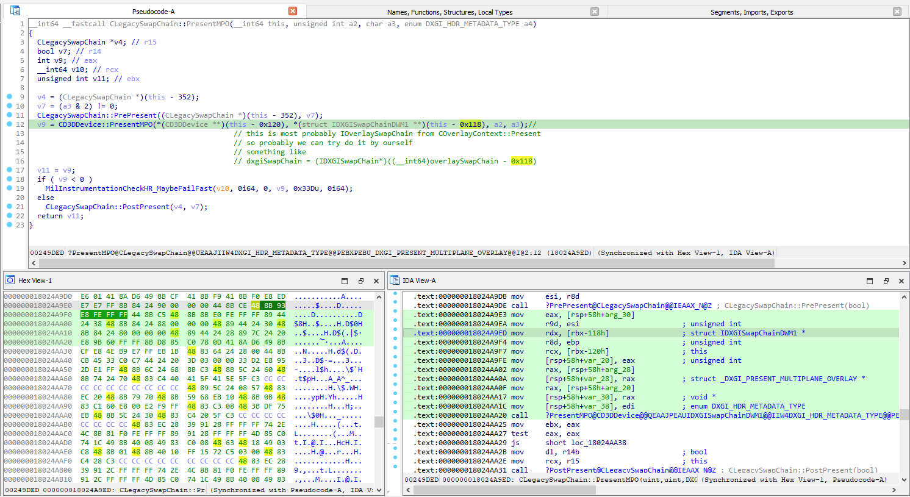

# wdwmo — Windows DWM Overlay

**A Windows Desktop Window Manager overlay implemented through an internal DirectX render-pipeline hook in `dwm.exe`.**

`wdwmo` is an educational and portfolio-oriented project that renders directly into the Desktop Window Manager composition pipeline. Instead of creating a transparent top-level window, the overlay code runs inside `dwm.exe`, intercepts an internal DWM present call, obtains the Direct3D 11 render target used for a particular display, and delegates initialization and drawing to user-provided callbacks.

> [!WARNING]
> The project is intended for reverse-engineering research and controlled experiments. It demonstrates a concept rather than serving as a finished product. The author is not liable for consequences resulting from the use of this project for purposes other than those intended.

## Contents

- [Features](#features)
- [Demonstration and tested configurations](#demonstration-and-tested-configurations)
- [Usage, API, integration model](#usage-api-integration-model)
- [TODO](#todo)
- [Explanation](#explanation)
  - [Related projects and their limitations](#related-projects-and-their-limitations)
  - [How DWM rendering works](#how-dwm-rendering-works)
  - [What do we need?](#what-do-we-need)
  - [Restored undocumented DXGI internals](#restored-undocumented-dxgi-internals)
  - [Project dependencies](#project-dependencies)
  - [Offsets determination](#offsets-determination)
    - [offsets.present](#offsetspresent)
	- [offsets.render_target](#offsetsrender_target)
	- [offsets.dxgi_output_vftable](#offsetsdxgi_output_vftable)
	- [offsets.dxgi_output](#offsetsdxgi_output)
	- [offsets.dxgi_swap_chain](#offsetsdxgi_swap_chain)
	- [offsets.get_physical_back_buffer and offsets.get_d3d11_resource](#offsetsget_physical_back_buffer-and-offsetsget_d3d11_resource)
  - [Project architecture](#project-architecture)
  - [Multiple initialization](#multiple-initialization-1)
- [Licensing](#licensing)

---

## Features

### Callback-based static-library architecture

The core is not tied to **ImGui** or any specific renderer. The integrating project supplies initialization, rendering, and optional termination callbacks. The **ImGui** implementation exists only as a Debug example.

### Windows 10 and Windows 11 render paths

The project supports the observed legacy and `CDDisplay` resource paths and selects a resource-access strategy from the generated configuration rather than relying on a single hardcoded Windows layout.

### Multi-monitor output identification

Each discovered render environment includes the physical output identity, desktop rectangle, display names, adapter, buffer size, and VidPn path IDs required to target rendering to the correct screen.

### Main display modes

The Debug sample demonstrates the information and coordinate handling required for extended, duplicated, and single-display configurations.

### Per-monitor scaling

Effective monitor DPI is converted to scaling factors and exposed in the environment. The sample applies these factors when translating a target window's desktop coordinates into screen-relative D3D render-target coordinates.

### Multiple initialization

A shared initialization guard allows callback implementations to be replaced while reusing the existing hook and original-function trampoline.

### Automated build-specific configuration

All offsets currently required by the core are recovered from the supplied `dwmcore.dll` / `dxgi.dll` images and matching PDB files, with the render-target-to-output field discovered at runtime from object identity.

### No hardcoded monitor index

The core does not assume that the target is the primary display or that output zero corresponds to the desired screen. Rendering contexts are associated with the actual `dwm` output object.

---

## Demonstration and tested configurations

### Windows 10 22H2 — real machine, NVIDIA



### Windows 11 25H2 — real machine, NVIDIA



### Windows 11 25H2 — VMware virtual machine



### Tested configurations

| Environment | Build | Observed DWM implementation | Resource access |
| --- | ---: | --- | --- |
| Windows 10 22H2, real NVIDIA system | 19045.6466 | `CLegacyRenderTarget` / `CLegacySwapChain` | legacy DXGI chain |
| Windows 11 25H2, VMware | 26200.8655 | legacy-style path similar to Windows 10 | modern internal buffer path and legacy fallback both work |
| Windows 11 25H2, real NVIDIA system | 26200.8037 | `CDDisplayRenderTarget` / `CDDisplaySwapChain` | internal physical back buffer → D3D11 resource |

These names describe the configurations observed during research. The selected path is not determined solely by the Windows version. GPU vendor, display driver, virtualization, and the compositor environment can cause the same Windows build to instantiate a different implementation.

---

## Usage, API, integration model

The Release core is intended to be statically linked into code that executes inside `dwm.exe`. Rendering is framework-independent and callback-based.

### Context model

The callback receives:

```cpp
struct context_t {
    environment_t& info; // cacheable per-resource information
    call_t& call;        // data belonging to the current Present call
};
```

`context.info` contains:

- output, device, immediate context, texture, and render-target-view pointers;
- buffer dimensions and format;
- adapter information;
- monitor handle, names, path, rectangle, scaling, rotation, and VidPn IDs;
- a local linked-value pool for operator state.

`context.call` contains:

- current `COverlayContext*`;
- current `IOverlaySwapChain*`;
- the DWM dirty-rectangle vector;
- the `legacy_present` flag passed to the original call.

### Minimal callback structure

```cpp
wdwmo::status_t on_initialize(const wdwmo::context_t& context) {
    // Called when a new render resource/environment is discovered,
    // and again when an existing environment is marked for reinitialization.

    // Initialize the renderer with:
    // context.info.device
    // context.info.device_context

    return wdwmo::status_t::success;
}

wdwmo::status_t on_render(const wdwmo::context_t& context) {
    auto device_context =
        context.info.device_context_as<ID3D11DeviceContext>();

    auto& target =
        context.info.render_target_view_as<ID3D11RenderTargetView>();

    device_context->OMSetRenderTargets(1, &target, nullptr);

    // Issue D3D11 draw commands here.

    return wdwmo::status_t::success;
}
```

Initialization is then performed with a generated configuration:

```cpp
const auto status = wdwmo::initialize(
    configuration,
    on_initialize,
    on_render,
    initialization_guard,
    false,
    on_terminate);
```

The guard and termination callback are optional. Without a guard, the core can still install and use the hook, but it cannot coordinate replacement by a later mapped copy through shared storage.

### Dumper usage

`wdwmcd` operates on memory buffers and does not require a live `dwm` object:

```cpp
wdwmo::configuration_t configuration{};

const auto status = wdwmcd::detect_configuration(
    {
        .image = { dwmcore_image, dwmcore_image_size },
        .pdb   = { dwmcore_pdb,   dwmcore_pdb_size   }
    },
    {
        .image = { dxgi_image, dxgi_image_size },
        .pdb   = { dxgi_pdb,   dxgi_pdb_size   }
    },
    configuration);
```

The matching PDB URL can be generated from a PE's RSDS record:

```cpp
std::string url;
wdwmcd::get_microsoft_server_pdb_url(image, image_size, url);
```

Downloading and caching the PDB is left to the operator. The sample loader performs the download through its own networking layer.

---

## TODO

### Core

- [ ] Update monitor rectangles, VidPn IDs, names, and DPI after configuration changes.
- [ ] Test Intel, AMD, hybrid-GPU, multi-adapter, HDR, rotation, and additional multi-monitor configurations.
- [ ] Derive or validate the `COverlayContext::Present` ABI from richer PDB/type information instead of only the build family.
- [ ] Expand verified Windows build coverage.

### Dumper

- [ ] Perform a full code review, refactoring, and cleanup.

### Other

- [ ] Add missing dependencies such as **ncore**.

---

## Explanation

### Related projects and their limitations

The project was developed after studying existing public DWM overlay implementations and the limitations of path-specific approaches:

- [aurenex/dwm-overlay](https://github.com/aurenex/dwm-overlay)
  - does not work on Windows 11 24H2+ with NVIDIA drivers.
  - does not support display-configuration changes.
  - under certain conditions, such as when Discord broadcasting is enabled, everything is displayed directly in the stream, but not on the screen.

- [chaosium43/dwm-overlay](https://github.com/chaosium43/dwm-overlay)
  - works only on Windows 11.
  - supports only the primary monitor.
  - manipulates DWM's internal state.
  - has many offset dependencies that are difficult to maintain.
  - its dumper requires external DbgHelp modules and analyzes PDB files cached on disk.

I therefore conducted research into DWM internals to address these issues.

---

### How DWM rendering works

DWM uses different rendering paths depending on the OS version, and different paths are possible even within the same version. The following shows how rendering works in the tested environments:

**Windows 10 22H2, build 19045.6466:**

```text
-3.	CComposition::Present
		CComposition *this				//rcx 1f87ae28960
		
-2.	CRenderTargetManager::Present (CRenderTargetManager::Present(*((CRenderTargetManager **)this + 11)))
		CRenderTargetManager *this		//rcx 1f87ae16f20	[CComposition+0x58]
	
	v12 = [1f87ae16f20 + 0x8] = 1F87EA15F80
	v15 = *(_QWORD *)v12 + *(int *)(*(_QWORD *)(*(_QWORD *)v12 + 0x48i64) + 0xC) + 0x48;
	v16 = (*(__int64 (__fastcall **)(__int64, __int64))(*(_QWORD *)v15 + 0x20i64))(v15, a2);
		[1f87ae16f20 + 0x8] = 1F87EA15F80
		[1F87EA15F80] 		= 1F87EA2D370
		[1F87EA2D370 + 48]	= 7FFA2D9EC7B0
		[7FFA2D9EC7B0 + C]	= 48A0
		1F87EA2D370 + 48A0 + 48 = 1f87ea31c58
-1.	IRenderTarget.VFTable[4] //called in cycle for each IRenderTarget
	IRenderTarget::Present [thunk] (return CLegacyRenderTarget::Present((CLegacyRenderTarget *)(a1 - *(int *)(a1 - 4)), a2))
		IRenderTarget* this				//rcx 1f87ea31c58
	v12 += 8i64 //take next
	
0.	CLegacyRenderTarget::Present
		CLegacyRenderTarget *this		//rcx 1f87ea31c58	IRenderTarget - [IRenderTarget-0x4]

1.	COverlayContext::Present (COverlayContext::Present((COverlayContext *)((char *)this - 18192), *((IOverlaySwapChain **)this - 2313), v15, &v22, v7, disableMpo))
		COverlayContext* this			//rcx 1f87ea2d548	CLegacyRenderTarget-0x4710
		IOverlaySwapChain* swapChain	//rdx 1f87e4d21a0	[CLegacyRenderTarget-0x4848]

2.	COverlayContext::PresentMPO
		COverlayContext* this			//rcx 1f87ea2d548
		IOverlaySwapChain* swapChain	//rdx 1f87e4d21a0

3.	IOverlaySwapChain.VFTable[18]
	CLegacySwapChain::PresentMPO [thunk] (return CLegacySwapChain::PresentMPO((CLegacySwapChain *)((char *)swapChain - *((int *)swapChain - 1)), a2, a3, a4);) // 1f87e4d21a0-[1f87e4d21a0-4] = 1f87e4d21a0 
		CLegacySwapChain* swapChain		//rcx 1f87e4d21a0

4.	CLegacySwapChain::PresentMPO
		CLegacySwapChain* this			//rcx 1f87e4d21a0

5.	CD3DDevice::PresentMPO (CD3DDevice::PresentMPO(*((CD3DDevice **)this - 36), *((struct IDXGISwapChainDWM1 **)this - 35), a2, a3))
		CD3DDevice* this				//rcx 1f87e91b600	[CLegacySwapChain-0x120]
		IDXGISwapChainDWM1* swapChain	//rdx 1f87e562fc8	[CLegacySwapChain-0x118]

6.	CD3DDrawingContext(CD3DDevice+0x108).VFTable[14]
	D2DDeviceContextBase<ID2D1DeviceContext6,ID2D1DeviceContext6,null_type>::PresentMultiplaneOverlay [thunk] (return D2DDeviceContextBase<ID2D1DCRenderTarget,ID2D1DCRenderTarget,ID2D1DeviceContext6>::PresentMultiplaneOverlay((DrawingContext *)((char *)drawingContext - 0x278), swapChain, a3, a4, a5, a6, a7, a8);)
		DrawingContext* context			//rcx 1f87c845da0	CD3DDevice+0x108
		IDXGISwapChainDWM1* swapChain	//rdx 1f87e562fc8
		
7.	D2DDeviceContextBase<ID2D1DCRenderTarget,ID2D1DCRenderTarget,ID2D1DeviceContext6>::PresentMultiplaneOverlay
		DrawingContext* context			//rcx 1f87c845b28	[CD3DDevice+0x108]-0x278
		IDXGISwapChainDWM1* swapChain	//rdx 1f87e562fc8

8.	DrawingContext::PresentMultiplaneOverlay
		DrawingContext *this			//rcx 1f87c845b28
		IDXGISwapChainDWM1 *swapChain	//rdx 1f87e562fc8
		
9.	IDXGISwapChainDWM1.VFTable[23] //aurenex/dwm-overlay hook is here
	CDXGISwapChainDWMLegacy::PresentMultiplaneOverlay [thunk] (CDXGISwapChain::PresentMultiplaneOverlay((CDXGISwapChain *)(*((_QWORD *)this + 8) + 88i64),a2,a3,a4,a5,a6,a7))
		CDXGISwapChainDWMLegacy *this	//rcx 1f87e562fc8

10.	CDXGISwapChain::PresentMultiplaneOverlay
		CDXGISwapChain *this			//rcx 1f87ea3a5d8	[CDXGISwapChainDWMLegacy+0x40]+0x58
```

I traced practically the entire present path on Windows 10 with MPO enabled, since it takes precedence. This clearly shows where the `aurenex/dwm-overlay` hook is placed and why this approach causes the main issues.

Windows 11 uses the same route on every build, but why does it fail only on 24H2+ with NVIDIA drivers?
This is because NVIDIA forces DWM to use `CDDisplayRenderTarget` instead of `CLegacyRenderTarget`.
The selector can be seen in `dwmcore.dll`, inside the `CRenderTargetManager::RenderAndPresent` function:

```cpp
CRenderTargetManager::SortMonitorTargets((CRenderTargetManager *)this, (__int64)&sortedMonitorTargetsVec);
sortedMonitorCurrent = (void *)sortedMonitorTargetsVec;
sortedMonitorEnd = v25;
while ( sortedMonitorCurrent != sortedMonitorEnd )
{
	drawingContext = this[86];
	renderTarget = *(_QWORD *)sortedMonitorCurrent + 8i64;
	renderAndPresent = *(__int64 (__fastcall **)(__int64, struct CDrawingContext *))(*(_QWORD *)renderTarget + 0x40i64);
	if ( renderAndPresent == CLegacyRenderTarget::RenderAndPresent )
	{
		renderAndPresentResult = CLegacyRenderTarget::RenderAndPresent(renderTarget, drawingContext); //legacy present path
	}
	else if ( (char *)renderAndPresent == (char *)CDDisplayRenderTarget::RenderAndPresent )
	{
		renderAndPresentResult = CDDisplayRenderTarget::RenderAndPresent(renderTarget, drawingContext); //modern present path
	}
	else
	{
		renderAndPresentResult = renderAndPresent(renderTarget, drawingContext);
	}
	
	rapHr = renderAndPresentResult;
	if ( renderAndPresentResult < 0 )
		MilInstrumentationCheckHR_MaybeFailFast(0x14u, &dword_18032D228, 3u, renderAndPresentResult, 0xBEu, 0i64);// dword_18032D228 dd 8898008Bh
		  
	if ( !v1 || v1 >= 0 && rapHr < 0 )
		v1 = rapHr;
		  
	sortedMonitorCurrent = (char *)sortedMonitorCurrent + 0x10;
}
    
detail::vector_facade<CRenderTargetManager::CSortedMonitorTarget,detail::buffer_impl<CRenderTargetManager::CSortedMonitorTarget,4,1,detail::liberal_expansion_policy>>::
	~vector_facade<CRenderTargetManager::CSortedMonitorTarget,detail::buffer_impl<CRenderTargetManager::CSortedMonitorTarget,4,1,detail::liberal_expansion_policy>>(&sortedMonitorTargetsVec);
```

I decided to use `COverlayContext::Present`, as `chaosium43/dwm-overlay` does, because it is used in both scenarios on both Windows versions and is the highest-level, easiest-to-maintain function I could find:

```text
CLegacyRenderTarget::Present / RenderAndPresent
    └─ COverlayContext::Present
           └─ CLegacySwapChain
                  └─ DXGI legacy present path

CDDisplayRenderTarget::Present / RenderAndPresent
    └─ COverlayContext::Present
           └─ CDDisplaySwapChain
                  └─ ddisplay-backed present path
```

---

### What do we need?

To draw our own content when hooking DWM, we need to obtain the rendering context. This requires four objects:

- `ID3D11Device`
- `ID3D11DeviceContext`
- `ID3D11Texture2D`
- `ID3D11RenderTargetView`

Every DWM overlay project obtains this information from different sources in its own way. For example, `aurenex/dwm-overlay` retrieves the device and texture from the `IDXGISwapChain`, whereas `chaosium43/dwm-overlay` obtains them from internal DWM structures - accessing the first through an offset and the second by calling a virtual function.

Experimental testing in my environments showed that both methods can be streamlined by obtaining a single key object- the `ID3D11Resource`, from which all the other components can be derived, thereby minimizing dependencies.

At first, I looked for direct getters and found only these:

```text
180064000 CLegacySwapChainBuffer::GetD3D11Resource(void)
180200800 CDDisplaySwapChainBuffer::GetD3D11Resource(void)
```

But what exactly is a `SwapChainBuffer`? As far as I can tell, it is an internal DWM wrapper around other objects. In any case, we need to obtain an instance of it. Fortunately, another direct getter is available on the `IOverlaySwapChain` received as the second parameter of `COverlayContext::Present`:

```text
180063E70 CLegacySwapChain::GetPhysicalBackBuffer(void)
1801EEA40 CDDisplaySwapChain::GetPhysicalBackBuffer(void)
```

all we need is to obtain these two vftable offsets, which must be the same within one environment, and then call:

```cpp
IOverlaySwapChain->GetPhysicalBackBuffer()->GetD3D11Resource();
```

This is straightforward on Windows 11, but Windows 10 lacks these methods and functions: there are no direct resource getters or intermediate objects. However, the rendering path does use `DXGISwapChain`, specifically within `CLegacySwapChain::PresentMPO`. On Windows 10, the legacy path is used regardless of whether an NVIDIA GPU is present, so we can extract the `DXGISwapChain` just as DWM does.

This is where the present path splits into two variants:

- Legacy present path
  - Works through `IDXGISwapChainDWM`.
- Modern present path
  - Works through `IOverlaySwapChainBuffer`.

We also need two `COverlayContext::Present` ABIs for Windows 10 and Windows 11 because they differ slightly:

**Windows 10 22H2:**

```cpp
HRESULT __fastcall COverlayContext::Present(
    COverlayContext* this,
    IOverlaySwapChain* swap_chain,
    ui32_t a3,
    const std::vector<RECT>& dirty_rects,
    ui32_t a5,
    bool legacy_present);
```

**Windows 11 25H2:**

```cpp
HRESULT __fastcall COverlayContext::Present(
    COverlayContext* this,
    IOverlaySwapChain* swap_chain,
    ui32_t a3,
    const std::vector<RECT>& dirty_rects,
    ui32_t a5,
    bool* a6,
    bool legacy_present);
```

At this stage, we can already build an experimental version capable of rendering something. However, a properly targeted overlay also requires additional information - at minimum, the desktop rectangle. With the data obtained so far, this is impossible if we need to account for all display modes, including **duplicate** and **extend**.

We cannot simply map these objects together because there is no direct dependency chain from `device` / `device_context` / `resource` / `render_target_view` to `dxgi_output`, and heuristic mappings are essentially guesswork with varying degrees of success.

Here, we need at least two values: the source-path VidPn ID and the target-path VidPn ID. I will not go into the details of how `QueryDisplayConfig` works on Windows, but both IDs are required to obtain the necessary information reliably. It is, of course, possible to manage with only one - the target VidPn ID, especially because the Windows 11 version of `dwmcore` has:

```text
1801ED7E0 CLegacySwapChain::GetVidPnTargetId(void)
1802BF4D0 COverlaySwapChain::GetVidPnTargetId(void)
```

Windows 10, however, has only:

```text
1800E2510 CDDisplaySwapChain::GetVidPnSourceId(void)
1800E3798 CLegacySwapChain::GetVidPnSourceId(void)
```

A simple cross-version solution was therefore not immediately apparent, so I examined the structures at runtime.

#### Runtime research



1. `COverlayContext*` instances for both monitors, obtained from `RCX` when `COverlayContext::Present` is called.
2. Their `C...RenderTarget*` objects, as expected, stored at offset `0x0`.
3. ``const ATL::CComObject<class CDXGIOutput>::`vftable'{for `IDXGIOutputDWM'}``, also stored at offset `0x0` in this structure, as expected.
4. The output's GDI display name.
5. The output's source VidPn ID.
6. The output's target VidPn ID.

It turns out that all the necessary information is available here.

I tried to determine what reads the addresses containing the target/source VidPn IDs, but on Windows 10, nothing appears to use them, at least when cycling through configurations such as `duplicate` → `extend` → `duplicate`. I examined the object's vftable and found something interesting.



The `GetDesc` function returns `DXGI_OUTPUT_DWM_DESC`. Because `dxgi.pdb` does not provide this structure layout, I had to determine it manually by tracing calls to the function.

#### Before executing `GetDesc`



1. A call to `GetDesc`.
2. The first argument, i.e. `DXGIOutputDWM*` (`this`).
3. The second argument, i.e. `DXGI_OUTPUT_DWM_DESC*` (`result`). This matches the caller code perfectly: `lea rdx, [rdi+20]`. It points to the stack.

Because `RDX` points to the stack, I simply inspected the stack.

#### Immediately after executing `GetDesc`



1. The function at which tracing is currently paused.
2. Values changed on the stack.

It is clear that `GetDesc` returns all the information we need. Only a few small steps remain: obtain its address, call it, and extract the required values from the result.

Later, I verified this again using a slightly different approach: allocating a buffer of length N and filling it with garbage values to see exactly what changed, allowing the layout to be mapped more accurately.

It is also clear that this object inherits from `IUnknown`. And, instead of determining its offsets by analyzing the PDB, we can simply declare the interface together with `DXGI_OUTPUT_DWM_DESC`.

The only difference between the two OS versions lies in the `DXGI_OUTPUT_DWM_DESC` structure, and that can be accounted for as well.

We also need a correctly defined `IDXGIOutputDWM`, including its GUID.
To obtain its GUID, I examined the `QueryInterface` implementation in that vftable, located the associated ATL COM map, and found the required entry.

### Restored undocumented DXGI internals

These are not exact replicas of DWM's actual internal structures, but they are accurate for each specified environment. Using them only required adjusting the union and declaring the structures correctly.

```cpp
//win10 22h2 19045 / win11 25h2 26200; 0x24
typedef struct _DXGI_OUTPUT_DWM_DESC_BASE {
	LUID adapterId;

	UINT sourceVidPnId;
	UINT targetVidPnId;

	UINT unknown0;
	UINT unknown1;
	UINT unknown2;

	INT width, height;
}DXGI_OUTPUT_DWM_DESC_BASE;

//win10 22h2 19045; 0xac, expanded to 0x100
typedef union _DXGI_OUTPUT_DWM_DESC_WIN10_22H2 {
	struct {
		_DXGI_OUTPUT_DWM_DESC_BASE base;

		UINT unknown3;
		UINT unknown4;
		UINT unknown5;
		UINT unknown6;
		UINT unknown7;

		RECT workingRect;
		RECT desktopRect;

		UINT unknown8;

		WCHAR deviceName[32];

		UINT unknown9;
		UINT unknown10;
		UINT unknown11;
		UINT unknown12;
	};

	BYTE raw[0x180] = { };
}DXGI_OUTPUT_DWM_DESC_WIN10;

//win11 25h2 26200; 0xc8, expanded to 0x100
typedef union _DXGI_OUTPUT_DWM_DESC_WIN11_25H2 {
	struct {
		_DXGI_OUTPUT_DWM_DESC_BASE base;

		UINT unknown3;
		UINT unknown4;
		UINT unknown5;
		UINT unknown6;
		UINT unknown7;

		UINT unknown8;
		UINT unknown9;
		UINT unknown10;
		UINT unknown11;
		UINT unknown12;

		RECT workingRect;
		RECT desktopRect;

		UINT unknown13;

		WCHAR deviceName[32];

		UINT unknown14;
		UINT unknown15;
		UINT unknown16;
		UINT unknown17;
		UINT unknown18;
		UINT unknown19;
	};

	BYTE raw[0x180] = { };
}DXGI_OUTPUT_DWM_DESC_WIN11;

typedef union _DXGI_OUTPUT_DWM_DESC {
	DXGI_OUTPUT_DWM_DESC_BASE base;

	DXGI_OUTPUT_DWM_DESC_WIN10 win10;
	DXGI_OUTPUT_DWM_DESC_WIN11 win11;

	BYTE raw[0x180] = { };
}DXGI_OUTPUT_DWM_DESC;
```

The restored `IDXGIOutputDWM`, including its GUID and required methods, is defined as follows:

```cpp
MIDL_INTERFACE("6f66a9a0-bece-4ee8-b11b-990eb38ed976")
IDXGIOutputDWM : public IUnknown{
	virtual BOOL STDMETHODCALLTYPE HasDDAClient() = 0;

	virtual HRESULT STDMETHODCALLTYPE GetDesc(
		DXGI_OUTPUT_DWM_DESC* pDesc
	) = 0;
};
```

We also need a correctly defined `IDXGISwapChainDWM`, taken from the `aurenex/dwm-overlay` repository.

```cpp
MIDL_INTERFACE("f69f223b-45d3-4aa0-98c8-c40c2b231029")
IDXGISwapChainDWMLegacy : public IDXGIDeviceSubObject{
	virtual HRESULT STDMETHODCALLTYPE Present(
		UINT syncInterval,
		UINT flags
	) = 0;

	virtual HRESULT STDMETHODCALLTYPE GetBuffer(
		UINT buffer,
		REFIID riid,
		void** ppSurface
	) = 0;
};
```

---

### Project dependencies

Now that we have established the complete set of items required for the task, we can consider how to obtain each one. Naturally, each item requires its own offset: some are found in structures, others in files, and others in virtual function tables. They are listed below:

| Name | Type | Kind | Target |
| --- | --- | --- | --- |
| `present` | rva | static | `COverlayContext::Present` |
| `render_target` | structure | static | `COverlayContext` → `C...RenderTarget` |
| `dxgi_output_vftable` | rva | static | ``const ATL::CComObject<class CDXGIOutput>::`vftable'{for `IDXGIOutputDWM'}`` |
| `dxgi_output` | structure | runtime | `C...RenderTarget` → `IDXGIOutputDWM` |
| `dxgi_swap_chain` | structure | static | `IOverlaySwapChain` → `IDXGISwapChainDWM` |
| `get_physical_back_buffer` | vftable | static | `IOverlaySwapChain::VFTable` → `GetPhysicalBackBuffer` |
| `get_d3d11_resource` | vftable | static | `ISwapChainBuffer::VFTable` → `GetD3D11Resource` |

Their purposes are:

- `present` - the RVA in `dwmcore.dll` of the main hook target.

- `render_target` - the offset from a `COverlayContext` instance to `CLegacy-/CDDisplay-RenderTarget`. This is required to identify the physical output monitor correctly, specifically its logical rectangle, VidPn ID, friendly name, and GDI name.

- `dxgi_output_vftable` - the RVA in `dxgi.dll` of the vftable located at the beginning of the `DXGIOutputDWM` object. It is used to identify the correct object.

- `dxgi_output` - the offset from `CLegacy-/CDDisplay-RenderTarget` to the field containing `IDXGIOutputDWM*`. It is more difficult to determine statically than to obtain at runtime.

- `dxgi_swap_chain` - the offset from `IOverlaySwapChain` to the field containing `IDXGISwapChainDWM`, allowing it to be used in legacy present-path configurations.

- `get_physical_back_buffer` - the `IOverlaySwapChain` vftable offset of the corresponding function used to retrieve the object from which `ID3D11Resource` is obtained.

- `get_d3d11_resource` - the `IOverlaySwapChainBuffer` vftable offset of the corresponding function used to retrieve `ID3D11Resource`.

All of this can be determined automatically through static analysis.

---

### Offsets determination

Obtaining offsets is automated ([wdwmcd](parts/dumper/)), but below I will describe how exactly offsets are found, and how you can do it manually using IDA or something else.

#### `offsets.present`:

Nothing complicated, just RVA for the "`COverlayContext::Present`" symbol, you can also find them manually using IDA.

---

#### `offsets.render_target`:

This is a bit more complicated, since we're talking about an offset into a structure whose layout isn't specified in the PDB file. We need to track down where and how this object is used. This isn't a difficult task; simply search IDA for the keywords "`RenderTarget`", "`MonitorTarget`", and other renames of these classes. In both Windows versions, this class is used in the `COverlayContext` constructor, which is very convenient for us since we're intercepting this class's function, so let's just look at where this argument is stored.



As we can see right at the beginning of the function, this argument is stored at offset `0x0` (`RCX` is `COverlayContext*`, e.g. the 1st parameter - `this`, and `RDX` - `IOverlayMonitorTarget*`, e.g. the 2nd parameter - `monitorTarget`). To automate updating, I find this function, disassemble it, and look for this place - where the second argument is stored at the pointer to the first, and take the offset value.

```cpp
auto crender_target_offset = ui64_t();

for (auto i = 0ui64, c = function_code.size(); i < c; i++) {
    const auto& instruction = function_code[i];
    if (*ui32_p(instruction.info.Mnemonic) != 'vom') continue; 			//is instruction is "mov"

    if (*ui32_p(instruction.operands[0].OpMnemonic) != 'xcr' ||			//is 1st operand is "rcx"
        *ui32_p(instruction.operands[1].OpMnemonic) != 'xdr') continue; //is 2nd operand is "rdx"

    conlog("[d] disassembled render target storing instruction: \"%s\"\n", instruction.complete_instruction);

    crender_target_offset = instruction.operands[0].Memory.Displacement; //take the 1st operand memory displacement

    break;
}
```

---

#### `offsets.dxgi_output_vftable`:

This is also not difficult, just RVA for the symbol "``const ATL::CComObject<class CDXGIOutput>::`vftable'{for `IDXGIOutputDWM'}``" in `dxgi.dll`.

---

#### `offsets.dxgi_output`:

This is where things get more interesting. I couldn't find any direct getters, and to determine the offset, I'd have to search for object usage/calls in related libraries, performing a complex and time-consuming analysis. Instead, since vftables are always located at the beginning of a class, knowing this and the address of the vftable of the desired class, we can simply iterate through each pointer in the structure and check whether the first field of the object pointed to by the pointer is the address of the desired vftable. If so, the object has been found.

```cpp
IUnknown* get_dxgi_dwm_output(const i32_t render_target_offset, const ui32_t vftable_offset, const range<address_t>& dxgi_bounds, void* overlay_context, i32_t& offset, i32_t begin = 0, i32_t count = 30) noexcept {
    auto expected_vftable_address = address_t(ui64_t(dxgi_bounds.min) + vftable_offset);
    auto structure = ui64_p(*ui64_p(ui64_t(overlay_context) + render_target_offset)); //CRenderTarget*

    conlog(
        "[w] " function_name ": \n"
        "    dxgi_bounds:     %#llx-%#llx\n"
        "    overlay_context: %#llx\n"
        "    offset:          %#lx\n"
        "    structure:       %#llx\n",
        dxgi_bounds.min, dxgi_bounds.max,
        overlay_context,
        offset,
        structure);

    if (offset) return (IUnknown*)(*ui64_p(ui64_t(structure) + offset));

    auto start = structure + begin;

    for (auto i = 0i32; i < count; i++) {
        auto pointer = start[i];
        if (!ncore::can_access(address_t(pointer))) continue;

        auto vftable_candidate = *address_p(pointer);
        if (vftable_candidate != expected_vftable_address) continue;
        
        offset = i * sizeof(ui64_t);

        return (IUnknown*)pointer;
    }

    return nullptr;
}
```

---

#### `offsets.dxgi_swap_chain`:

Similar to `offsets.render_target`, since I couldn't find any direct getters, I need to find a way to use the required instances, retrieving them from some structure we could access from a hook. Luckily, such a place exists - `CLegacySwapChain::PresentMPO`. 



In this function, `CD3DDevice::PresentMPO` is called, which takes the swapchain we need as the second argument, so I simply look for these two functions, in the first I find the place where the second is called and from there I go back until I find where the second argument is formed.

```cpp
auto dxgi_swapchain_offset = ui64_t();

for (auto i = 0ui64, c = function_code.size(); i < c; i++) {
    const auto& instruction = function_code[i];
    if (*ui32_p(instruction.info.Mnemonic) != 'llac') continue; //is instruction is "call"

    if (instruction.info.AddrValue != expected_delta) continue; //is call for CD3DDevice::PresentMPO

    for (auto j = i, s = 0ui64; j > s; j--) {
        const auto& second = function_code[j];
		if (*ui32_p(second.info.Mnemonic) != 'vom') continue; //is instruction is "mov"
		
		if (*ui32_p(second.operands[0].OpMnemonic) != 'xdr') continue; //is first operand is "rdx"

		dxgi_swapchain_offset = second.operands[1].Memory.Displacement;

		conlog("[d] disassembled dxgi swap chain storing instruction: \"%s\"\n", second.complete_instruction);

		goto _DXGISCDisassemblyEnd;
	}
}
_DXGISCDisassemblyEnd:
```

---

#### `offsets.get_physical_back_buffer` and `offsets.get_d3d11_resource`:

Since these two offsets are vftable offsets to functions, their search algorithm is identical. There are two options:
1. Find the expected vftable and find the desired function in it.
2. Find the desired function and check all vftables for its presence.

The project implements the first method: we find the expected vftables, then search for these two functions in these vftables. We also compare their offsets, but for now we don't take into account any discrepancies; in general, they are expected to be identical.

```cpp
const char* vftables[] = {
    "??_7CLegacySwapChain@@",
    "??_7CDDisplaySwapChain@@"
};

const char* methods[] = {
	"CLegacySwapChain::GetPhysicalBackBuffer",
	"CDDisplaySwapChain::GetPhysicalBackBuffer"
};

_result.offsets.get_physical_back_buffer = find_vftable_method_offset(
	raw,
	dbi,
	dwmcore_target.image.data,
	dwmcore_target.image.size,
	dwmcore_pe,
	"get_physical_back_buffer",
	vftables,
	_countof(vftables),
	methods,
	_countof(methods));
}
```

```cpp
const char* vftables[] = {
    "??_7CLegacySwapChainBuffer@@",
    "??_7CDDisplaySwapChainBuffer@@"
};

const char* methods[] = {
    "CLegacySwapChainBuffer::GetD3D11Resource",
    "CDDisplaySwapChainBuffer::GetD3D11Resource"
};

_result.offsets.get_d3d11_resource = find_vftable_method_offset(
    raw,
    dbi,
    dwmcore_target.image.data,
    dwmcore_target.image.size,
    dwmcore_pe,
    "get_d3d11_resource",
    vftables,
    _countof(vftables),
    methods,
    _countof(methods));
```

---

### Project architecture

The project is designed as a statically linked, callback-based library whose core should rarely need modification.

The project consists of three parts:

- `wdwmo` (`Windows DWM Overlay`): the project core - a module loaded directly into `dwm.exe`. The Debug build includes a sample implementation featuring an **ImGui** window that displays basic information.

- `wdwmcd` (`Windows DWM Core Dumper`): a module responsible for automatically retrieving all required offsets and analyzing `dwmcore.dll` and `dxgi.dll` using PDB files.

- `wdwmosl` (`Windows DWM Overlay Sample Loader`): a sample loader project. It retrieves offsets from system libraries or libraries specified by the user and loads either a custom or the standard Debug `wdwmo` build into `dwm.exe`.

All three components have dependencies, one of which is missing: `ncore`, which I do not plan to include in the project at this stage. To build the project, you must replace all uses of `ncore` with your own equivalents. There are few such uses, so this is not difficult; however, keep in mind that `ncore::disassembly` is a wrapper around **BeaEngine**.

#### Toolchain

- `Windows x64`.
- `Visual Studio` / `MSVC`.
- `C++20`.
- `Windows SDK` with `D3D11`, `DXGI`, `SHCore`, and related headers/libraries.

The reverse-engineering logic and wrapper ABI are x64-specific.

#### Included/external components

| Component | Used by | Repository form | License |
| --- | --- | --- | --- |
| MinHook | `wdwmo` | header and static library | BSD 2-Clause-style notices, including HDE32/HDE64 |
| Direct3D 11 / DXGI and Windows APIs | `wdwmo` and sample | Windows SDK/system components | Microsoft terms |
| raw_pdb | `wdwmcd` | bundled source | BSD 2-Clause |
| BeaEngine | `wdwmcd` | bundled static library | LGPL-3.0-or-later |
| Dear ImGui 1.92.8 | Debug sample only | bundled source | MIT |
| cpr | `wdwmosl` networking layer | bundled static library | MIT |
| curl / libcurl 7.86.0-DEV | `wdwmosl` networking layer | bundled static library | curl license |
| zlib 1.2.13 | libcurl compression support | bundled static library | zlib license |
| ncore | project utilities | private author-owned utilities | stated separately when distributed |

#### No DIA SDK or DbgHelp requirement

Unlike implementations that delegate symbol handling to the **DIA SDK** or **DbgHelp**, `wdwmcd` parses the supplied PDB data directly through **raw_pdb**. The core/dumper design therefore does not require a separately installed DIA runtime or a DbgHelp-based symbol session.

The project still uses standard Windows system libraries and statically linked helper libraries where appropriate. Here, "no dynamic dependencies" means that no additional external symbol-engine DLL is required.

---

### Multiple initialization

Repeated manual mapping or loading of a new implementation into `dwm.exe` must not blindly install another hook over an existing trampoline.

`wdwmo::initialization_guard` solves this by keeping a small shared record in a caller-selected process storage location. The Debug sample uses a field in the process environment block as the storage slot, but the provider is supplied by the operator.

The shared state records:

- a storage identifier;
- the active `working_set`;
- the existing implementation's termination callback;
- a shared core termination callback;
- an operator-controlled key/value pool.

When a new initialization finds an existing working set:

1. the previous operator termination callback is invoked;
2. the original hook/trampoline and working set are reused;
3. rendering is temporarily suspended;
4. initialization and rendering callbacks are replaced;
5. cached environments are marked for reinitialization;
6. rendering resumes.

This allows a new mapped implementation to replace its callback logic without stacking hooks or losing the original `COverlayContext::Present` trampoline.

The mechanism is intentionally operator-managed because the storage location and commit semantics depend on how the integrating project maps or unloads code.

---

## Licensing

The original project code is released under the [MIT License](license.txt):

```text
Copyright (c) 2026 nepoladka
```

The MIT license applies only to code authored for this project. Bundled
third-party source and static libraries retain their own licenses and copyright
notices. The authoritative component list and complete notices are provided in
[`third_party_notices.md`](third_party_notices.md) and the [`.licenses/`](.licenses/)
directory.

| Component | License |
| --- | --- |
| Dear ImGui | MIT |
| raw_pdb | BSD 2-Clause |
| MinHook and bundled HDE portions | BSD 2-Clause-style notices |
| BeaEngine | LGPL-3.0-or-later |
| cpr | MIT |
| curl / libcurl | curl license |
| zlib | zlib license |

> [!IMPORTANT]
> BeaEngine is currently distributed as a static library. The LGPL can require
> corresponding source and relinkable application material, or a suitable
> shared-library mechanism, when a combined binary is distributed. Adding a
> license file alone does not satisfy every static-link distribution scenario.
> See [Third-party notices](third_party_notices.md#beaengine-and-static-linking).

> [!CAUTION]
> `shared/includes/sources/binaries/consola.ttf.h` appears to contain embedded
> Consolas font data. It is not covered by the project's MIT license. Verify an
> applicable redistribution right or replace/remove the embedded font before a
> public release.

The bundled `libcurl.lib` identifies itself as `7.86.0-DEV` and uses the Windows
Schannel backend. Rebuilding cpr/libcurl with another feature set can introduce
additional license obligations; the third-party notice must be updated whenever
those binaries are replaced.

---
